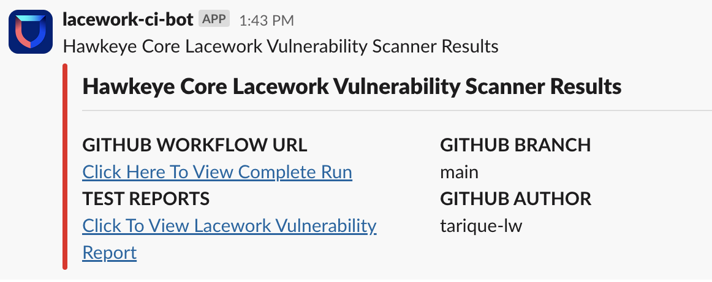

# report-to-slack

<!-- action-docs-description -->
## Description

Publish customized message in a Slack channel
<!-- action-docs-description -->

<!-- action-docs-inputs -->
## Inputs

| parameter | description | required | default |
| --- | --- | --- | --- |
| channel-id | Slack channel ID or channel name where message will be posted. | `true` |  |
| title | Title text for the message | `true` |  |
| attachment_color | Attachment color | `false` |  |
<!-- action-docs-inputs -->

<!-- action-docs-outputs -->

<!-- action-docs-outputs -->

<!-- action-docs-runs -->
## Runs

This action is a `composite` action.
<!-- action-docs-runs -->

## Install Slack App in Channel

In the respective Slack channel where you wish to post messages to,invite the bot user by running command `/invite @lacework-ci-bot` and hit enter. The bot will be installed in the channel.

Reference: [Technique 2: Slack App](https://github.com/slackapi/slack-github-action#technique-2-slack-app)

## Usage

This action assumes an AWS which requires OIDC to authenticate so specify `id-token: write` for the job.
```yaml
    permissions:
      id-token: write
```

### Example

```yaml
- name: Send Results To Slack
  uses: lacework-dev/oss-actions/report-to-slack-v1@main
  with:
    channel-id: "channel-name" 
  env:
    SLACK_GITHUB_WORKFLOW_URL: "<https://github.com/${{ github.repository }}/actions/runs/${{ github.run_id }}|Click Here To View Complete Run>"
    SLACK_TEST_REPORTS: "Test Reports Link"
    SLACK_GITHUB_AUTHOR: ${{ github.actor }}
    SLACK_GITHUB_BRANCH: ${{ github.ref_name }}
    TITLE_TEXT: "Title of Report"
    HEADER_TEXT: "Header of the report"
    ATTACHMENT_COLOR: "#36a65f"
```
### Sample Report


### Adding Fields
To add more fields in the report, add those as env variables inside the slack reporting step in the format `SLACK_KEY: “VALUE”`. Here, the key name after `SLACK_` will be counted as field title with the respective value provided. 

For e.g. `SLACK_TEST_REPORTS`, In the report field will be displayed as `TEST_REPORTS` with the appropriate value provided.

### Result Color Codes
* `#36a64f` - <span style="color:#36a64f">good</span>
* `#E92020` - <span style="color:#E92020">bad</span>
* `#D97A1A` - <span style="color:#D97A1A">warning</span>

For example if you had a previous step
```yaml
   ATTACHMENT_COLOR: ${{ (steps.check_results.outcome == 'success' && '#36a64f') || (steps.check_results.outcome == 'failure' && '#E92020') || '#D97A1A' }}
```

### Dos and Don'ts
1. Do not make changes to the below env variables
   * `TITLE_TEXT` 
   * `HEADER_TEXT` 
   * `ATTACHMENT_COLOR`
2. Do not make any change to the below input
   * `slack-bot-token`
3. `SLACK_GITHUB_WORKFLOW_URL` env variable represents the current workflow run url. The value is generic and shouldn’t be changed.
4. If any key value is not needed in the workflow to be posted in the report, it can be removed.
